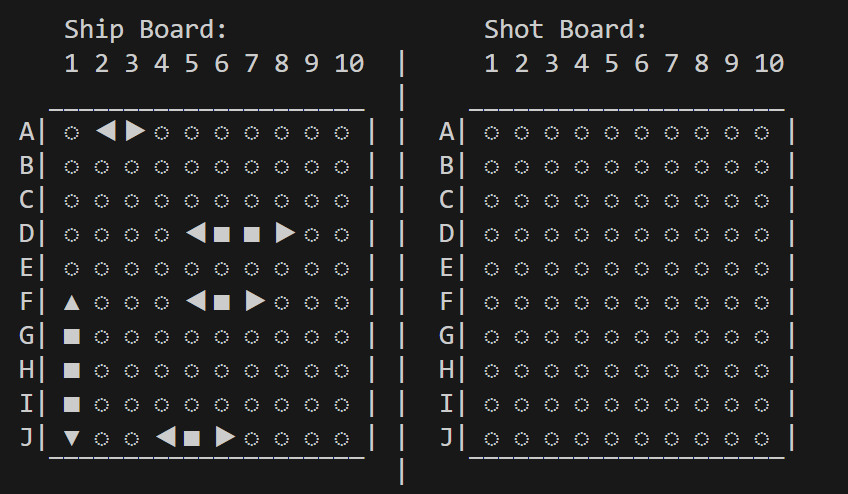

# the-team-assignment-team-19

## SINKING SHIPS

**Built with:** C, ASCII, Bash

Sinking Ships is a strategic battleship game designed for single or multiplayer use. Users can play against AI and select the level of difficulty. The ships are arranged on a grid and the users take turns to locate and sink the opponent’s ships. 

## **Features** 
- **Interactive Gameplay**: Players can input coordinates to target opponent ships and receive feedback on hits, misses, and sinks. 
- **Opponent AI**: A simple AI algorithm for the computer opponent to shoot at the player’s board. 
- **Dynamic Game Board**: Real-time updates to the boards for both players. 
- **Help System**: Display detailed instructions and usage information via the _--help_ argument.

## **How to Play & Rules**
- **1.** This is a terminal-based game. 
- **2.** User can compile the game by running: _gcc -o SinkingShips main.c game.c opponentAI.c_
- **3.** User can start the game by running: _./SinkingShips Or ./SinkingShips --play_
- **4.** This is intended to be a two-player game. The user can play against an AI.
- **5.** The user can choose the difficulty level with the AI.
- **6.** The player will be prompted to place 5 ships. They select the coordinate at which the ship starts and extend it vertically or horizontally.
- **7.** The player cannot overlap the ships.
- **8.** The game begins as each player takes turns choosing the coordinates they want to shoot at.
- **9.** The game will end once all of a player's ships have been sunk.

## **Example Usage**
- **User input:** _./SinkingShips_
- **Output:** Enter the start position of the ship (A1-J10):

- **User input:** _A1_
- **Output:** Do you want the ship to be vertical or horizontal? (v/h):

- **User input:** _v_

_(Process repeats until all ships are placed)_

_(User will continue selecting coordinates until the game ends)_
